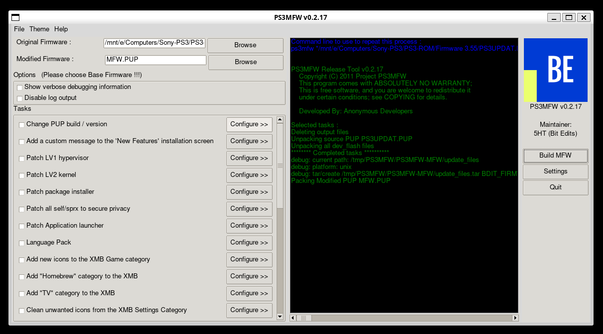

PS3MFW
======

PS3 Modified Firmware Release Tool. `Version 2025`.

# Features

* Lightweight (4K CLOC)
* Windows (Mingw-64), Linux (WSL)

# Dependencies

PS3MFW uses following external binaries:

* `ps3tools` - utilities for certified files (PUP/PKG/SELF)
* `rcomage` - utility for RCO recource containers
* `gimconv` - utility for GIM graphics image files (wine)

# Banner

```
  .------.  .-------. .-----.   ..  .-.   .--------.      .--.
 /_____   \/   _____//_____  \ /  \/   \ /_   _____/\    /   /
  /   ____/\____  \  __(__  < /         \ /   __)\   \/\/   / 
 /   /     /       \/        \   /\/\    Y   /    \        /  
/___/     /________/_________/__/    \___|__/      \__/\__/   
```

# Intro

Several exciting new tasks have been created. The most interesting one is a new privacy patch,
which keeps PS3 from sending personally identifiable information to many configurable domain
names: After jailbreak became available for PS3, reverse engineers discovered that the PS3
collects a multitude of personal information without your knowledge, such as such as your
TV model, a list of all usb devices (including product IDs) you ever plugged into your PS3,
usage statistics, which games and media you play and more.

The Digital Millenium Copyright Act (DMCA) specifically allows for consumers to circumvent
technological protection measures in order to protect their privacy. Even though there was
little doubt concerning the legality of PS3MFW Builder before because it in itself does not
circumvent any technological protection measures, this new feature makes using it inside the
USA fully DMCA compliant.

Additionally, several new customizations including a firmware version spoofer, a way to
edit the look and sound of the boot sequence by inserting your own coldboot files, and a
task to replace the default "Airbush" XMB theme. Now it can also create modified firmwares
that can be installed on PS3s with broken Blu-Ray drives as well as create firmwares that
can convert demo (kiosk/shop) units into regular retail PS3s! A bug that prevented USB
storage devices from being shown under Game Data Utility was fixed.

# Tasks

* `patch_privacy.tcl` – PS3 collects a large amount of personal information while it’s operating. Additionally personal information is sent to many domain names when internet access is enabled (unrelated to PSN access). This task prevents PS3 from sending any data to the domain names you select.
* `broken_bluray.tcl` – Allows you to remove Blu-Ray firmware installation so that the MFW can be installed without a working Blu-Ray drive. This is potentially dangerous if used on a PS3 with a working drive, and should only be used if the drive is broken.
* `spoof_version.tcl` – Allows changing the firmware version the PS3 appears to be on, similar to the rebug spoofer.
* `change_ssl_cer.tcl` – Allows changing of SSL certificates.
* `change_theme.tcl` – Can be used to replace the default "Airbrush" theme with another theme file (.p3t format).
* `patch_shop.tcl` – Creates firmware to transform demo PS3s (the units used in stores) into full retail PS3s, without the need for service mode!
* `patch_category_game.tcl` - Add new icons to the XMB Game category. Modifies `category_game.xml`.
* `patch_lv1.tcl` - Patch LV1 hypervisor. Modifies CORE OS `lv1.self`.
* `patch_lv2.tcl` - Patch LV2 kernel. Modifies CORE OS `lv1.self`.
* `patch_nas_plugin.tcl` - Patch package installer. Modifies `nas_plugin.sprx`.
* `patch_vsh.tcl` - Patch Application launcher. Modifies `vsh.self`.
* `add_license_msg.tcl` Modifies PUP license.xml. Add a custom message to the 'New Features' installation screen.
* `clean_friends.tcl` - Clean unwanted icons from the XMB Friends Category.
* `clean_game.tcl` - Clean unwanted icons from the XMB Game Category.
* `clean_music.tcl` - Clean unwanted icons from the XMB Music Category.
* `clean_network.tcl` - Clean unwanted icons from the XMB Network Category.
* `clean_photo.tcl` - Clean unwanted icons from the XMB Photo Category.
* `clean_psn.tcl` - Clean unwanted icons from the XMB PlayStation Network Category.
* `clean_video.tcl` - Clean unwanted icons from the XMB Video Category.

Console
-------

```
$ tclsh ps3mfw --gui false
```

GUI
---

```
$ tclsh ps3mfw
```



Credits
-------

* Anonymous Developers (Code Monkeys)
* 5HT (Bit Edits)
